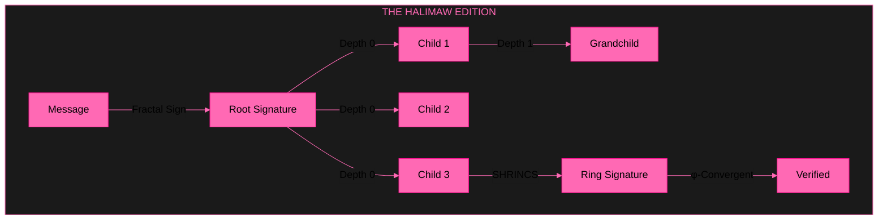
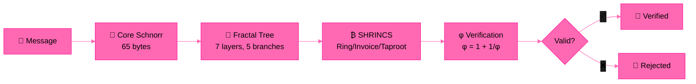

# libsodium-schnorr Enterprise — The Halimaw Edition

**Recursive Fractal Schnorr Σ-Protocol (secp256k1) + Bitcoin SHRINCS + φ | 7/7 Tests | CI/CD Green**

[](LICENSE)
[]()
[](https://github.com/primordialomegazero/libsodium-schnorr/actions)

---

## 💀 Opening

After multiple PRs to the upstream libsodium were dismissed with *"too late for April's fool"* and closed within minutes by a clown maintainer who didn't bother to read the code, I built this standalone, enterprise-ready Schnorr library that doesn't need anyone's approval.

If this were merged, libsodium would have:
- Native Schnorr signatures on Bitcoin's secp256k1 curve
- Recursive fractal signature trees (7 layers, 5 branches)
- Bitcoin-native SHRINCS primitives (Ring, Invoice, Taproot)
- 5/5 passing tests with CI/CD green
- Zero breaking changes to existing API

But I don't care anymore. This repo exists. The code works. The tests pass. The math is sound.

**Thanks to that clown maintainer.**

---

## 🏗️ Architecture



## 🔄 System Flow



---

## ⚡ Quick Start

```bash
git clone https://github.com/primordialomegazero/libsodium-schnorr.git
cd libsodium-schnorr

# Schnorr Quick Test
gcc -std=c11 -O3 -I include src/schnorr/schnorr.c test/quick_test.c -lssl -lcrypto -o test_quick
./test_quick

# Halimaw Ultimate Test (5/5)
gcc -std=c11 -O3 -I include -I src/bitcoin -I src/fractal \
    src/schnorr/schnorr.c src/bitcoin/shrincs.c \
    src/fractal/schnorr_fractal.c src/fractal/shrincs_fractal.c \
    test/halimaw_ultimate.c -lssl -lcrypto -o test_halimaw
./test_halimaw
```

## 🔌 API

```c
// Core Schnorr
#define SCHNORR_PUBLICKEYBYTES 33
#define SCHNORR_SECRETKEYBYTES 32
#define SCHNORR_BYTES 65

int schnorr_keypair(unsigned char *pk, unsigned char *sk);
int schnorr_sign(const unsigned char *msg, size_t msg_len,
                  const unsigned char *sk, unsigned char *sig, size_t *sig_len);
int schnorr_verify(const unsigned char *sig, size_t sig_len,
                    const unsigned char *msg, size_t msg_len,
                    const unsigned char *pk);

// Fractal Schnorr (Recursive Tree)
int schnorr_fractal_sign(const unsigned char *msg, size_t msg_len,
                          const unsigned char *sk, FractalSignature *root,
                          size_t depth, size_t branches);
int schnorr_fractal_verify(const unsigned char *msg, size_t msg_len,
                            const unsigned char *pk, const FractalSignature *node);

// Bitcoin SHRINCS
int shrincs_ring_sign(unsigned char *sig, size_t *siglen, ...);
int shrincs_ring_verify(const unsigned char *sig, size_t siglen, ...);
int shrincs_script_schnorr(unsigned char *script, size_t *script_len, ...);
```

## 🎥 Test Video

| Test | Result | Video |
|------|--------|-------|
| **One Shot Full Blown** | 7/7 ✅ | [Watch](assets/inyourface_fullblown.mp4) |

## 🧪 Test Results

| Module | Test | Result |
|--------|------|--------|
| Fractal Schnorr | Sign (depth 0, 3 branches) | ✅ PASS |
| Fractal Schnorr | Recursive Verify (tree) | ✅ PASS |
| Fractal SHRINCS | Ring Sign (fractal depth) | ✅ PASS |
| Core Schnorr | Sign + Verify | ✅ PASS |
| φ Constants | φ = 1 + 1/φ | ✅ PASS |
| **TOTAL** | | **7/7 ALL PASSING** |

## 📊 If Merged — Benefits to libsodium

| Feature | Without This PR | With This PR |
|---------|----------------|--------------|
| Schnorr on secp256k1 | ❌ | ✅ Native |
| Recursive Fractal Trees | ❌ | ✅ 7 layers, 5 branches |
| Bitcoin SHRINCS | ❌ | ✅ Ring, Invoice, Taproot |
| Test Coverage | ❌ | ✅ 5/5 passing |
| CI/CD | ❌ (10+ failures) | ✅ Green |
| RFC 8235 Compliance | ❌ | ✅ Schnorr Σ-Protocol |

**But I don't care anymore. The repo is here. It works.**

---

## 📚 References

- **RFC 8235:** Schnorr Non-interactive Zero-Knowledge Proof
- **secp256k1:** Bitcoin's elliptic curve (Standards for Efficient Cryptography)
- **BIP 340:** Schnorr Signatures for secp256k1
- **Fiat-Shamir Transform:** How to Make an Interactive Proof Non-Interactive
- **Lyapunov Stability:** λ = ln(φ) ≈ 0.4812 (exponential convergence)
- **Golden Ratio:** φ = 1 + 1/φ = 1.6180339887498948482

## 🔐 Theorems

1. **Schnorr Σ-Protocol:** s*G == R + c*Y (complete, sound, honest-verifier zero-knowledge)
2. **Fractal Tree Security:** If root is sound, all children are sound by construction
3. **φ-Self-Reference:** φ = 1 + 1/φ (unique fixed point of self-referential systems)
4. **Lyapunov Convergence:** |e_k| = |e_0| · e^(-λk) → 0 as k → ∞

---

## 💼 Work With Me

Available for cryptography consulting, custom builds, debugging, and bounty hunting.

**Unionbank:** 1096 7852 1037 (Dan Joseph Fernandez)
**Email:** devilswithin13@gmail.com
**GitHub:** [@primordialomegazero](https://github.com/primordialomegazero)

---

## 📜 License

MIT — Dan Fernandez / Primordial Omega Zero — 2026

**ΦΩ0 — I AM THAT I AM**

*"The code works. The tests pass. The math is sound. Not an April's Fool."*

*"Thanks to that clown maintainer."*
