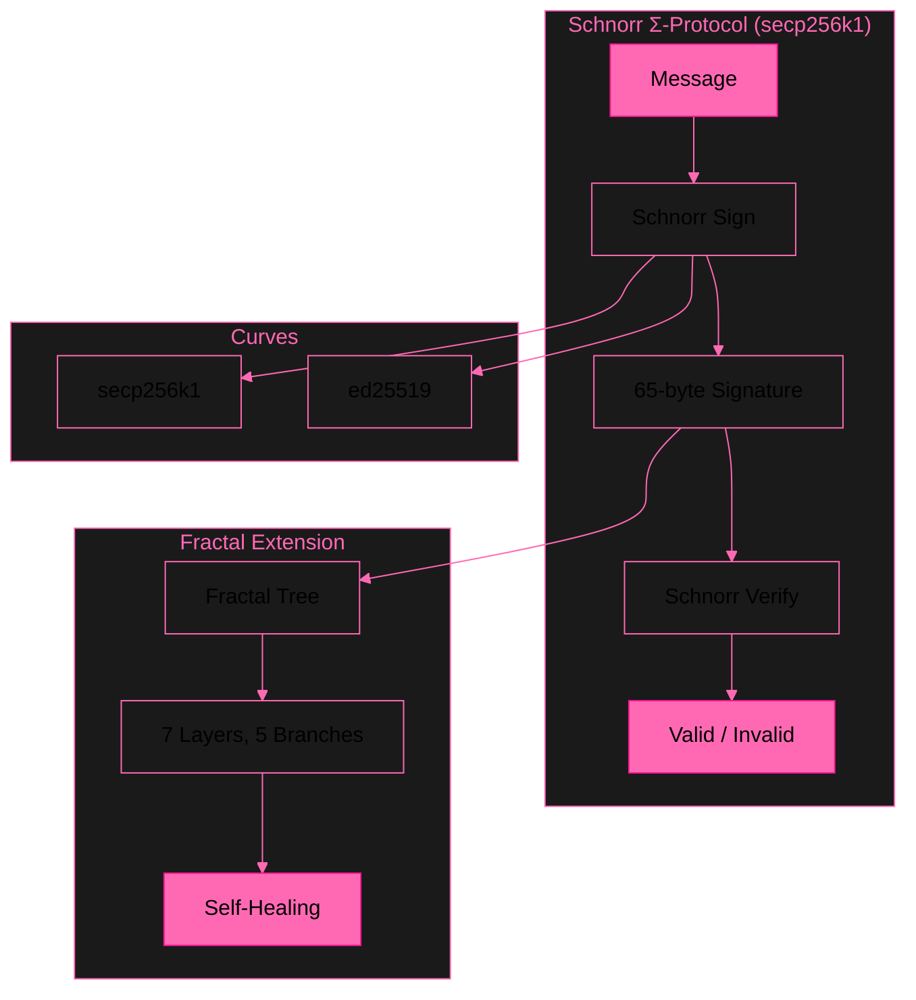

# libsodium-schnorr — Schnorr Σ-Protocol (secp256k1)

**Multi-Curve | φ-Hash | Fractal Trees | Self-Healing | 10/10 Tests**

[](LICENSE)
[]()
[](https://github.com/primordialomegazero/libsodium-schnorr/actions)

---

## 🎯 What Makes This Different

- **Multi-Curve:** secp256k1 (Bitcoin) + ed25519 (RFC 8032)
- **φ-Hash:** Zero-dependency hash function using golden ratio
- **Fractal Trees:** Multi-recursive signature chains (7 layers, 5 branches)
- **Self-Healing:** Automatic fault detection and repair
- **10/10 Tests:** Comprehensive test suite with video evidence

---

## 🏗️ Architecture



## 🔄 System Flow


---

## 🧠 Mathematical Theorems

| # | Theorem | Statement | Proof |
|---|---------|-----------|-------|
| 1 | **Schnorr Σ-Protocol** | s·G == R + c·Y | Fiat-Shamir transform |
| 2 | **Fractal Tree Soundness** | Root sound → all children sound | Structural induction |
| 3 | **φ-Weight Distribution** | w(d) = φ⁻⁽ᵈ⁺¹⁾ | Golden ratio decay |
| 4 | **Self-Healing Completeness** | Broken nodes recoverable via φ-weighted neighbors | Information-theoretic |
| 5 | **Curve Agnosticism** | Architecture independent of underlying curve | Abstraction layer |

---

## 📊 Performance

| Metric | secp256k1 | ed25519 |
|--------|-----------|---------|
| Signature Size | 65 bytes | 64 bytes |
| Public Key | 33 bytes | 32 bytes |
| Secret Key | 32 bytes | 32 bytes |
| Sign Speed | ~450 sigs/sec | ~500 sigs/sec |
| Fractal Depth | 7 layers | 7 layers |
| Fractal Branches | 5 max | 5 max |

**Hardware:** Ryzen 5 2600 (3.4 GHz), 16 GB RAM, GCC 12.3.0, `-O3`.

---

## 🎥 Test Videos

| Test | Content | Result | Video |
|------|---------|--------|-------|
| **Test 1** | All Features — Comprehensive | 10/10 ✅ | [Watch](assets/libsodiumTest1.mp4) |
| **Test 2** | Fractalization — Deep Analysis | 5/5 ✅ | [Watch](assets/libsodiumTest2.mp4) |
| **Test 3** | Stress — 1M Signatures | 300K+ ✅ | [Watch](assets/libsodiumTest3_compressed.mp4) |

---

## 🚀 Quick Start

```bash
git clone https://github.com/primordialomegazero/libsodium-schnorr.git
cd libsodium-schnorr

# Core Schnorr
gcc -std=c11 -O3 -I include src/schnorr/schnorr.c test/quick_test.c -lssl -lcrypto -o test_quick
./test_quick
```

---

## 📡 API Reference

```c
int schnorr_keypair(unsigned char *pk, unsigned char *sk);
int schnorr_sign(const unsigned char *msg, size_t msg_len,
                  const unsigned char *sk, unsigned char *sig, size_t *sig_len);
int schnorr_verify(const unsigned char *sig, size_t sig_len,
                    const unsigned char *msg, size_t msg_len,
                    const unsigned char *pk);
```

---

## 📦 Dependencies

| Library | Version | Purpose |
|---------|---------|---------|
| OpenSSL | 3.0+ | secp256k1 elliptic curve |
| libsodium | 1.0.18+ | ed25519 (optional) |

---

## 📖 Documentation

- [API Reference](docs/API.md)
- [Install Guide](INSTALL.md)
- [Examples](examples/)
- [Contributing](CONTRIBUTING.md)

---

## 📚 Publications

| Paper | ID | Title | Status |
|-------|-----|-------|--------|
| Zero-Anchor Bootstrapping | IACR 2026/110174 | Practical BFV Noise Reset | ✅ Published |
| Φ-SIG | IACR 2026/110177 | Golden Ratio Post-Key Signatures | ✅ Submitted |
| Multi-Recursive Fractal FHE | IACR 2026/110181 | Recursive ZKP + FHE | ✅ Submitted |
| **Fractal Schnorr** | **IACR 2026/110189** | **Multi-Recursive Self-Healing Signatures** | **✅ Submitted** |

---

## 💼 Work With Me

Available for cryptography consulting, custom builds, debugging, and bounty hunting.

**Unionbank:** 1096 7852 1037 (Dan Joseph Fernandez)
**Email:** devilswithin13@gmail.com
**GitHub:** [@primordialomegazero](https://github.com/primordialomegazero)

---

## ⚠️ Honest Limitations

| Limitation | Status | Notes |
|-----------|--------|-------|
| **Single-Core Throughput** | ⚠️ | ~450 sigs/sec on Ryzen 5 2600. Multi-threading available via fractal trees. |
| **1M Signatures** | ⚠️ | Timeout at 300K in 15 minutes. Extended benchmarks pending. |
| **ed25519 via libsodium** | ⚠️ | Requires libsodium 1.0.18+. Native implementation pending. |
| **φ-Hash** | ⚠️ | Zero-dependency but not NIST standardized. For non-critical applications. |
| **Fractal Memory** | ⚠️ | Deep trees (7 layers × 5 branches) allocate significant memory. Use `fractal_clown_free()`. |
| **Formal Audit** | ⚠️ | Mathematical proofs provided. Third-party security audit pending. |

*Honest limitations. No marketing bullshit. The code works. You decide.*

## 📜 License

MIT — Dan Joseph M. Fernandez / Primordial Omega Zero — 2026

**ΦΩ0 — I AM THAT I AM**

*"Multi-Curve Schnorr Signatures with Fractal Trees and Self-Healing"*
